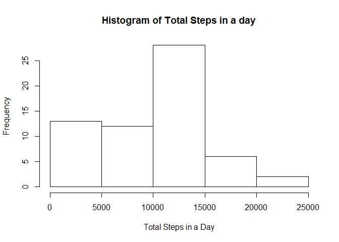
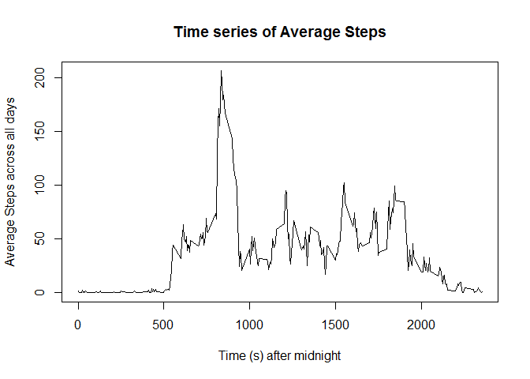
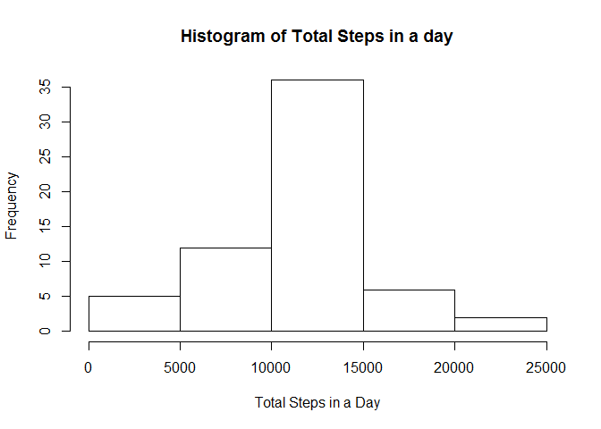
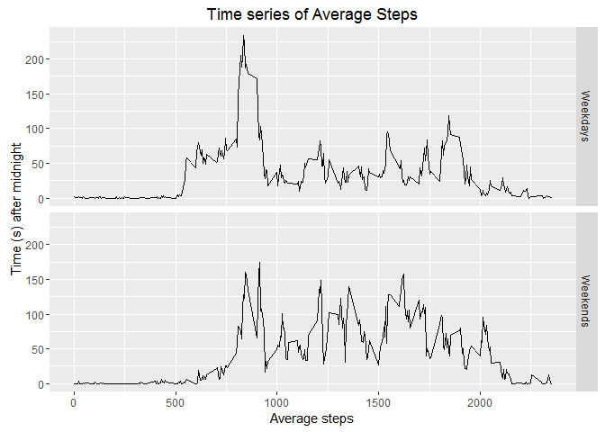

# Reproducible Research: Peer Assessment 1

## Loading and preprocessing the data

```r
# Loading useful libraries
library(dplyr, warn.conflicts = FALSE)
library(readr)
library(ggplot2)

# Unzip and read file
mydata <- read_csv(unz("activity.zip", "activity.csv"), col_types = cols(date = col_date(format = "")))
```

## What is mean total number of steps taken per day?

```r
# Summarizing total steps grouped via days
daySteps <- mydata %>% group_by(date) %>% summarize(total_steps = sum(steps, na.rm = TRUE))

# Plot a histogram of total steps in a day
hist(daySteps$total_steps, main = "Histogram of Total Steps in a day", xlab = "Total Steps in a Day")
```

<!-- -->

#### Mean of total number of steps per day: **9354.2295082**  
#### Median of total number of steps per day: **10395**

## What is the average daily activity pattern?

```r
# Summarizing averages grouped via intervals
intervalSteps <- mydata %>% group_by(interval) %>%
    summarize(steps = mean(steps, na.rm = TRUE))

# Plotting the time series of Average Steps
plot(intervalSteps, type = "l",
     main = "Time series of Average Steps",
     ylab = "Average Steps across all days", xlab = "Time (s) after midnight")
```

<!-- -->

#### Interval with maximum number of steps (averaged across all days): **835**

## Imputing missing values

#### Number of missing values in dataset: **2304**

```r
# Mean of the 5 min intervals over all days were used to fill missing data
filledData <- mydata
filledData$steps[is.na(mydata$steps)] <- 
    sapply(mydata$interval[which(is.na(mydata$steps))], function(x) with(intervalSteps, steps[interval == x]))

# Summarizing total steps grouped via days
dayFilled <- filledData %>% group_by(date) %>% summarize(total_steps = sum(steps))

hist(dayFilled$total_steps, main = "Histogram of Total Steps in a day", xlab = "Total Steps in a Day")
```

<!-- -->

#### Mean of total number of steps per day: **1.0766189\times 10^{4}**  
#### Median of total number of steps per day: **1.0766189\times 10^{4}**  
#### **Both the mean and median increased from inputting missing data**

## Are there differences in activity patterns between weekdays and weekends?

```r
# Create a new column dayType denoting weekday/weekend
mydata$dayType <- sapply(mydata$date, function(d){
    if (weekdays(d) %in% c("Saturday", "Sunday")) "Weekends"
    else "Weekdays"
})
# Summarizing averages grouped by intervals and dayType
intervalSteps2 <- mydata %>% group_by(interval, dayType) %>%
    summarize(steps = mean(steps, na.rm = TRUE))

# Panel plot of the time series of Average Steps
ggplot(intervalSteps2, aes(interval, steps)) + geom_line() + facet_grid(dayType ~ .) +
    labs(title = "Time series of Average Steps") +
    labs(x = "Average steps", y = "Time (s) after midnight")
```

<!-- -->
